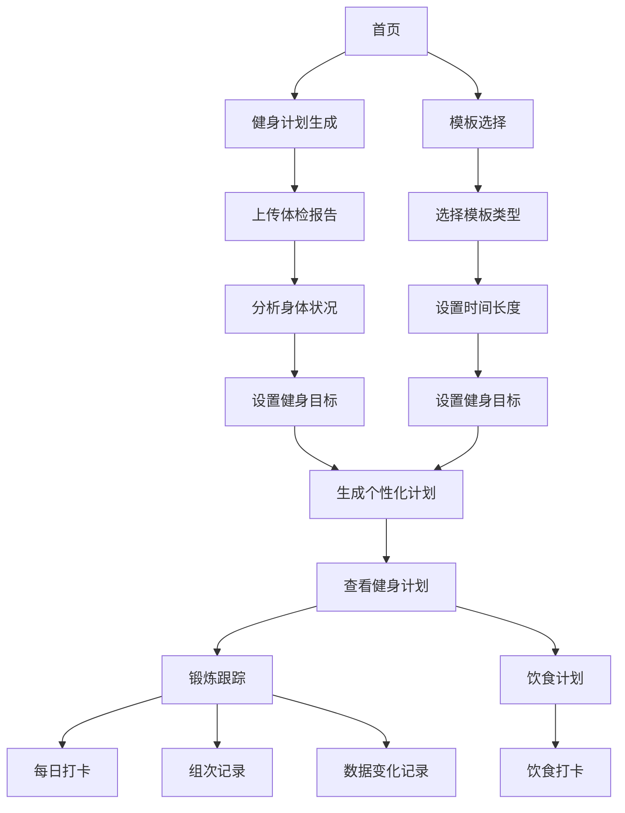

## 1. 产品概述
健身计划系统是一个帮助用户根据身体状况和目标生成个性化健身计划并跟踪锻炼进度的平台。
- 主要功能包括体检报告分析、健身计划生成、模板选择、饮食计划和锻炼跟踪。
- 目标用户为需要科学健身指导的个人，市场价值在于提供个性化、数据驱动的健身解决方案。

## 2. 核心功能

### 2.1 用户角色
| 角色 | 注册方式 | 核心权限 |
|------|---------------------|------------------|
| 普通用户 | 邮箱注册 | 创建和管理个人健身计划，记录锻炼数据 |

### 2.2 功能模块
1. **首页**：系统介绍、功能导航、用户信息
2. **健身计划生成**：体检报告分析、目标设置、计划生成
3. **模板选择**：预设健身模板、时间和目标选择
4. **锻炼跟踪**：每日打卡、组次记录、数据变化记录
5. **饮食计划**：饮食建议、饮食打卡

### 2.3 页面详情
| 页面名称 | 模块名称 | 功能描述 |
|-----------|-------------|---------------------|
| 首页 | 系统介绍 | 展示系统功能，引导用户开始使用 |
| 首页 | 导航栏 | 提供各功能模块的快速访问 |
| 首页 | 用户信息 | 显示用户基本信息和当前计划状态 |
| 健身计划生成 | 体检报告分析 | 上传或输入体检报告数据，分析身体状况 |
| 健身计划生成 | 目标设置 | 选择健身目标（增肌、减脂、塑形等） |
| 健身计划生成 | 计划生成 | 基于分析结果和目标生成个性化健身计划 |
| 模板选择 | 模板展示 | 展示不同类型的预设健身模板 |
| 模板选择 | 时间设置 | 选择计划时长（1周-6个月） |
| 模板选择 | 目标设置 | 选择健身目标 |
| 锻炼跟踪 | 每日打卡 | 记录每日锻炼完成情况 |
| 锻炼跟踪 | 组次记录 | 记录每次锻炼的组数、次数、重量等详细数据 |
| 锻炼跟踪 | 数据变化 | 记录体重、围度等身体数据的变化 |
| 饮食计划 | 饮食建议 | 基于健身目标提供饮食建议 |
| 饮食计划 | 饮食打卡 | 记录每日饮食完成情况 |

## 3. 核心流程
用户使用流程：
1. 用户注册/登录系统
2. 选择健身计划生成方式：
   - 上传体检报告，设置目标，生成个性化计划
   - 选择预设模板，设置时间和目标，生成计划
3. 查看生成的健身计划，包括每日训练内容和饮食建议
4. 开始执行计划，每日记录锻炼情况和饮食情况
5. 定期更新身体数据，跟踪进度变化

## 4. 用户界面设计
### 4.1 设计风格
- 主色调：蓝色 (#165DFF) 和绿色 (#36D399)
- 辅助色：白色 (#FFFFFF) 和浅灰色 (#F3F4F6)
- 按钮风格：圆角矩形，有轻微的阴影效果
- 字体：主标题使用 Inter Bold，正文使用 Inter Regular
- 字体大小：标题 24-32px，正文 14-16px，辅助文字 12px
- 布局风格：卡片式布局，清晰的信息层次
- 图标风格：线性图标，简洁现代

### 4.2 页面设计概览
| 页面名称 | 模块名称 | UI元素 |
|-----------|-------------|-------------|
| 首页 | 系统介绍 | 大型英雄区，展示系统核心功能，使用渐变背景，配有简洁的图标 |
| 首页 | 导航栏 | 固定顶部导航，包含 logo、主要功能链接和用户头像 |
| 健身计划生成 | 体检报告分析 | 表单上传区域，进度条显示分析过程，结果展示卡片 |
| 健身计划生成 | 计划生成 | 动态生成的计划表格，包含详细的训练内容和时间安排 |
| 模板选择 | 模板展示 | 卡片式布局展示不同模板，包含模板名称、适用人群和简要说明 |
| 锻炼跟踪 | 每日打卡 | 日历视图显示打卡情况，打卡按钮有动画效果 |
| 锻炼跟踪 | 数据变化 | 折线图展示身体数据变化趋势，支持时间范围选择 |
| 饮食计划 | 饮食建议 | 卡片式展示每日饮食建议，包含食物种类和份量 |

### 4.3 响应式设计
- 桌面优先设计，适配平板和移动设备
- 移动设备上使用汉堡菜单，优化触摸交互
- 表格在移动设备上转换为卡片式布局
- 确保所有交互元素在触摸设备上有足够的点击区域

### 4.4 3D场景指导（不适用）
本项目不包含3D场景