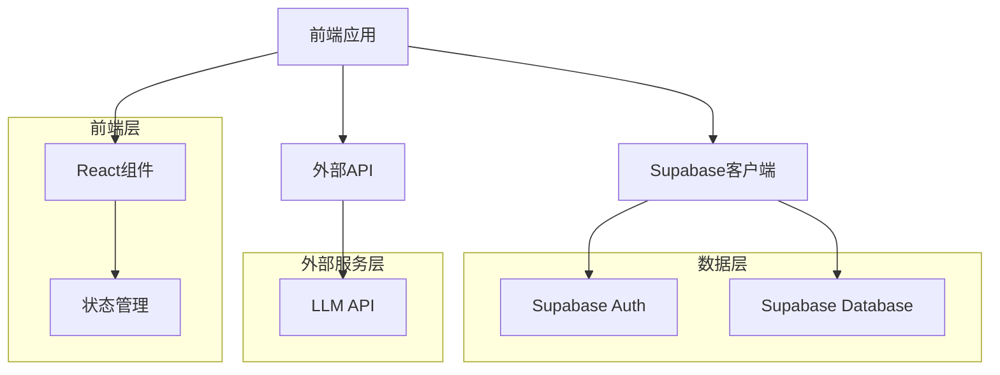

## 1. 架构设计


## 2. 技术描述
- 前端：React@18 + TypeScript + Tailwind CSS@3 + Vite
- 状态管理：Zustand
- 后端：Supabase (Authentication, Database, Storage)
- 外部服务：LLM API (用于分析体检报告)
- 初始化工具：vite-init

## 3. 路由定义
| 路由 | 用途 |
|-------|---------|
| / | 首页 |
| /plan/generate | 健身计划生成 |
| /plan/templates | 模板选择 |
| /track | 锻炼跟踪 |
| /diet | 饮食计划 |
| /profile | 用户个人资料 |

## 4. API定义
### 4.1 前端API调用
- Supabase Auth API：用户注册、登录、登出
- Supabase Database API：数据CRUD操作
- LLM API：分析体检报告，生成健身计划

### 4.2 数据模型
#### 4.2.1 用户表 (users)
| 字段名 | 数据类型 | 描述 |
|---------|---------|---------|
| id | uuid | 用户ID (Supabase Auth) |
| email | text | 用户邮箱 |
| name | text | 用户名 |
| created_at | timestamp | 创建时间 |

#### 4.2.2 健身计划表 (fitness_plans)
| 字段名 | 数据类型 | 描述 |
|---------|---------|---------|
| id | uuid | 计划ID |
| user_id | uuid | 用户ID |
| name | text | 计划名称 |
| type | text | 计划类型 (custom/template) |
| goal | text | 健身目标 |
| duration | integer | 计划时长 (周) |
| start_date | date | 开始日期 |
| end_date | date | 结束日期 |
| created_at | timestamp | 创建时间 |

#### 4.2.3 训练日程表 (workout_schedules)
| 字段名 | 数据类型 | 描述 |
|---------|---------|---------|
| id | uuid | 日程ID |
| plan_id | uuid | 计划ID |
| day | integer | 星期几 (1-7) |
| workout_type | text | 训练类型 |
| description | text | 训练描述 |
| created_at | timestamp | 创建时间 |

#### 4.2.4 训练动作表 (workout_exercises)
| 字段名 | 数据类型 | 描述 |
|---------|---------|---------|
| id | uuid | 动作ID |
| schedule_id | uuid | 日程ID |
| name | text | 动作名称 |
| sets | integer | 组数 |
| reps | integer | 次数 |
| duration | integer | 持续时间 (秒) |
| created_at | timestamp | 创建时间 |

#### 4.2.5 锻炼记录表 (workout_records)
| 字段名 | 数据类型 | 描述 |
|---------|---------|---------|
| id | uuid | 记录ID |
| user_id | uuid | 用户ID |
| plan_id | uuid | 计划ID |
| schedule_id | uuid | 日程ID |
| exercise_id | uuid | 动作ID |
| date | date | 记录日期 |
| sets_completed | integer | 完成组数 |
| reps_completed | integer | 完成次数 |
| weight | decimal | 重量 |
| duration | integer | 持续时间 (秒) |
| created_at | timestamp | 创建时间 |

#### 4.2.6 身体数据表 (body_measurements)
| 字段名 | 数据类型 | 描述 |
|---------|---------|---------|
| id | uuid | 记录ID |
| user_id | uuid | 用户ID |
| date | date | 记录日期 |
| weight | decimal | 体重 (kg) |
| waist | decimal | 腰围 (cm) |
| hip | decimal | 臀围 (cm) |
| chest | decimal | 胸围 (cm) |
| arm | decimal | 臂围 (cm) |
| leg | decimal | 腿围 (cm) |
| created_at | timestamp | 创建时间 |

#### 4.2.7 饮食计划表 (diet_plans)
| 字段名 | 数据类型 | 描述 |
|---------|---------|---------|
| id | uuid | 计划ID |
| plan_id | uuid | 健身计划ID |
| meal_type | text | 餐型 (breakfast/lunch/dinner) |
| description | text | 饮食描述 |
| created_at | timestamp | 创建时间 |

#### 4.2.8 饮食记录表 (diet_records)
| 字段名 | 数据类型 | 描述 |
|---------|---------|---------|
| id | uuid | 记录ID |
| user_id | uuid | 用户ID |
| diet_plan_id | uuid | 饮食计划ID |
| date | date | 记录日期 |
| completed | boolean | 是否完成 |
| created_at | timestamp | 创建时间 |

## 5. 数据定义语言
### 5.1 创建表结构
```sql
-- 用户表 (由Supabase Auth自动创建)

-- 健身计划表
CREATE TABLE fitness_plans (
  id UUID PRIMARY KEY DEFAULT gen_random_uuid(),
  user_id UUID REFERENCES auth.users(id),
  name TEXT NOT NULL,
  type TEXT NOT NULL CHECK (type IN ('custom', 'template')),
  goal TEXT NOT NULL,
  duration INTEGER NOT NULL,
  start_date DATE NOT NULL,
  end_date DATE NOT NULL,
  created_at TIMESTAMP DEFAULT NOW()
);

-- 训练日程表
CREATE TABLE workout_schedules (
  id UUID PRIMARY KEY DEFAULT gen_random_uuid(),
  plan_id UUID REFERENCES fitness_plans(id),
  day INTEGER NOT NULL CHECK (day BETWEEN 1 AND 7),
  workout_type TEXT NOT NULL,
  description TEXT,
  created_at TIMESTAMP DEFAULT NOW()
);

-- 训练动作表
CREATE TABLE workout_exercises (
  id UUID PRIMARY KEY DEFAULT gen_random_uuid(),
  schedule_id UUID REFERENCES workout_schedules(id),
  name TEXT NOT NULL,
  sets INTEGER,
  reps INTEGER,
  duration INTEGER,
  created_at TIMESTAMP DEFAULT NOW()
);

-- 锻炼记录表
CREATE TABLE workout_records (
  id UUID PRIMARY KEY DEFAULT gen_random_uuid(),
  user_id UUID REFERENCES auth.users(id),
  plan_id UUID REFERENCES fitness_plans(id),
  schedule_id UUID REFERENCES workout_schedules(id),
  exercise_id UUID REFERENCES workout_exercises(id),
  date DATE NOT NULL,
  sets_completed INTEGER,
  reps_completed INTEGER,
  weight DECIMAL,
  duration INTEGER,
  created_at TIMESTAMP DEFAULT NOW()
);

-- 身体数据表
CREATE TABLE body_measurements (
  id UUID PRIMARY KEY DEFAULT gen_random_uuid(),
  user_id UUID REFERENCES auth.users(id),
  date DATE NOT NULL,
  weight DECIMAL,
  waist DECIMAL,
  hip DECIMAL,
  chest DECIMAL,
  arm DECIMAL,
  leg DECIMAL,
  created_at TIMESTAMP DEFAULT NOW()
);

-- 饮食计划表
CREATE TABLE diet_plans (
  id UUID PRIMARY KEY DEFAULT gen_random_uuid(),
  plan_id UUID REFERENCES fitness_plans(id),
  meal_type TEXT NOT NULL CHECK (meal_type IN ('breakfast', 'lunch', 'dinner')),
  description TEXT NOT NULL,
  created_at TIMESTAMP DEFAULT NOW()
);

-- 饮食记录表
CREATE TABLE diet_records (
  id UUID PRIMARY KEY DEFAULT gen_random_uuid(),
  user_id UUID REFERENCES auth.users(id),
  diet_plan_id UUID REFERENCES diet_plans(id),
  date DATE NOT NULL,
  completed BOOLEAN DEFAULT FALSE,
  created_at TIMESTAMP DEFAULT NOW()
);
```

### 5.2 权限设置
```sql
-- 为anon角色授予基本读取权限
GRANT SELECT ON fitness_plans TO anon;
GRANT SELECT ON workout_schedules TO anon;
GRANT SELECT ON workout_exercises TO anon;
GRANT SELECT ON workout_records TO anon;
GRANT SELECT ON body_measurements TO anon;
GRANT SELECT ON diet_plans TO anon;
GRANT SELECT ON diet_records TO anon;

-- 为authenticated角色授予所有权限
GRANT ALL PRIVILEGES ON fitness_plans TO authenticated;
GRANT ALL PRIVILEGES ON workout_schedules TO authenticated;
GRANT ALL PRIVILEGES ON workout_exercises TO authenticated;
GRANT ALL PRIVILEGES ON workout_records TO authenticated;
GRANT ALL PRIVILEGES ON body_measurements TO authenticated;
GRANT ALL PRIVILEGES ON diet_plans TO authenticated;
GRANT ALL PRIVILEGES ON diet_records TO authenticated;
```

### 5.3 初始数据
```sql
-- 预设健身模板
INSERT INTO fitness_plans (id, user_id, name, type, goal, duration, start_date, end_date)
VALUES 
  (gen_random_uuid(), NULL, '基础减脂计划', 'template', '减脂', 4, CURRENT_DATE, CURRENT_DATE + INTERVAL '4 weeks'),
  (gen_random_uuid(), NULL, '增肌强化计划', 'template', '增肌', 8, CURRENT_DATE, CURRENT_DATE + INTERVAL '8 weeks'),
  (gen_random_uuid(), NULL, '全身塑形计划', 'template', '塑形', 6, CURRENT_DATE, CURRENT_DATE + INTERVAL '6 weeks');

-- 为基础减脂计划添加训练日程
-- 这里需要根据实际模板内容添加详细的训练日程和动作
```